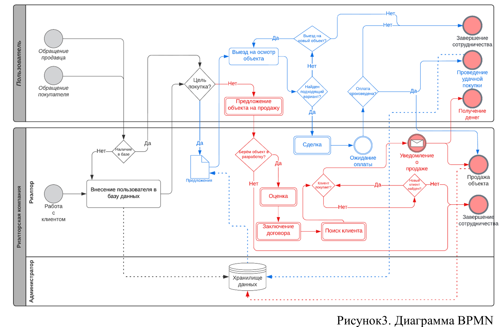

# Риелторская фирма
В BPMN-модели, построенной для данной работы наблюдается покупатель, посетитель, сотрудник компании и БД. Клиент, независимо от его цели, проверяется на наличие в базе данных и добавляется при его отсутствии. Данные помещаются в хранилище. Далее определяется цель клиента, покупка либо продажа. 
При покупке клиенту предлагается список предложений, который собирается из базы данных. После покупатель осматривает объект за объектом пока не найдёт подходящий вариант либо не откажется от услуг компании. При нахождении подходящего варианта проводится сделка с оплатой объекта, которая фиксируется в базе данных.
При продаже своего объекта с клиентом обсуждаются условия, производится оценка и заключается договор. Далее под объект производится поиск покупателя и при успешной продаже уведомляем об этом владельца

